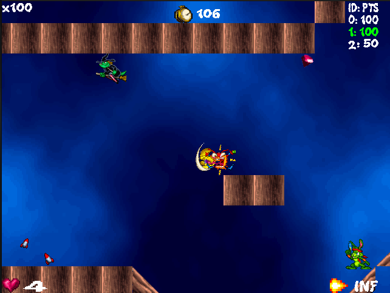

# Jazz JackRabbit 2 - TP Final 1C2024

Trabajo practico para la materia **Taller de Programación, Catédra Veiga, de la Facultad de Ingeniería, Universidad de Buenos Aires (UBA)**.

Jazz JackRabbit 2 es un shooter de plataformas 2D de los años 90, originalmente desarrollado por Epic MegaGames. En esta versión, hemos hecho una remake multijugador que permite disfrutar de la acción clásica con tus amigos en línea localmente.

## Integrantes - Grupo 10

- [Tomás Della Vecchia ](https://github.com/tomdv18)
- [Santiago Janon](https://github.com/smsx42)
- [Patricio Silva](https://github.com/lTomaas)
- [Kevin Emir Carbajal Robles](https://github.com/4cea2)

## Imagenes del juego

 

 

 

 

 

 

 

## Editor de mapas
 

 
