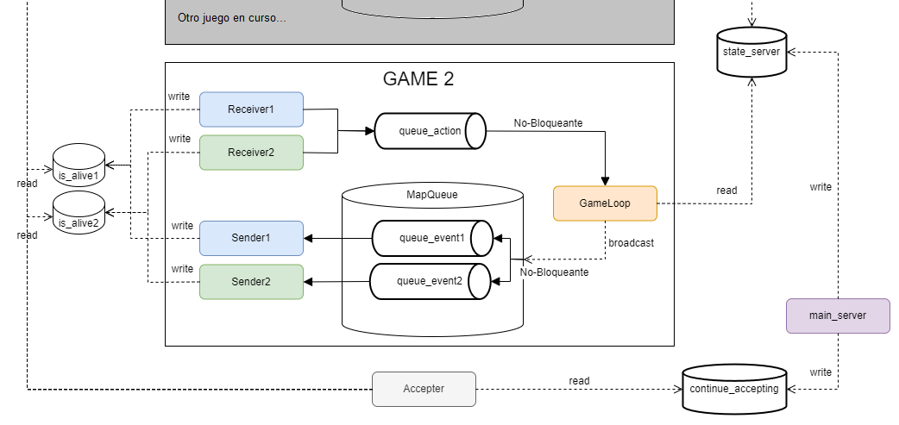
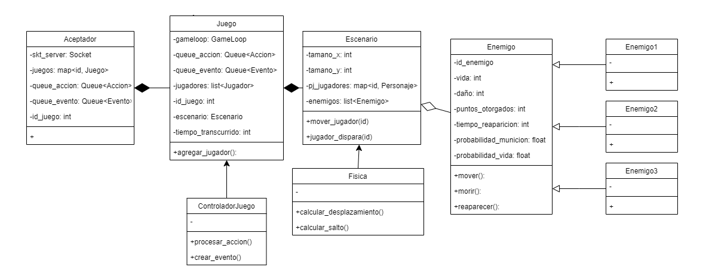
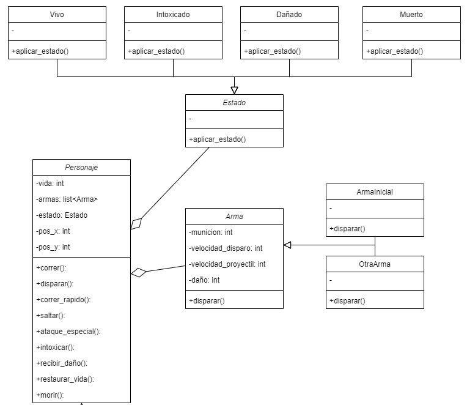
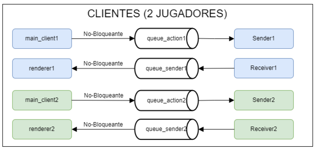
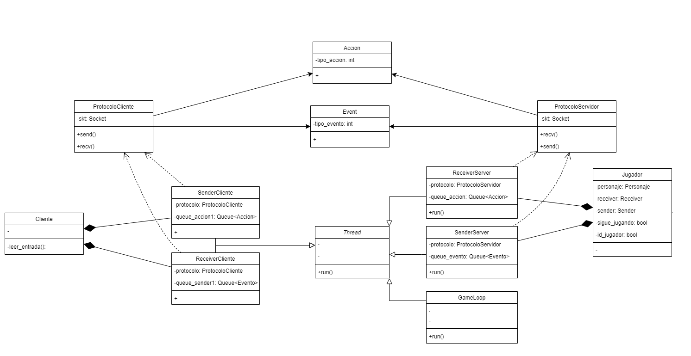

# Documentación Tecnica

Es importante comprender que el proyecto se divide en 3 partes.

Por un lado la parte del **cliente**, que incluye desde la clase cliente hasta el renderizado de los sonidos y objetos.

La parte común a **cliente y servidor**, que incluye desde los sockets y los threads hasta partes fundamentales del protocolo de comunicación como lo son las acciones.

Y por ultimo el **servidor**, que incluye toda la logica del servidor como así también del juego en si.

En cuanto a las clases, aqui podemos observar ciertos diagramas que esclareceran un poco su comportamiento y conexiones con el resto de clases
## Servidor

### Sobre el manejo de las partidas

Cada partida posee una cola que encolará las acciones de los jugadores, para luego desencolarlas y procesarlas una a una. Luego de procesar las acciones, se le envia a cada cliente en una cola particular el resultado de las mismas para que estos puedan renderizar el juego con su nuevo estado.

### Sobre el juego
El juego no solo posee un escenario con sus fisicas incluidas, sino que tambien incluye a unos enemigos, los cuales heredan de una clase llamada Enemigo, para que luego todos tengan comportamientos particulares

Una situación similar ocurre con los personajes, estos heredan de una clase padre abstracta llamada Personaje. Cada personaje tiene por lo menos un arma, la cual utiliza para disparar.

## Cliente

Cada cliente tiene dos queues, una para encolar sus acciones y enviarlas al servidor y la otra para recibir los eventos del servidor y renderizarlos

### Esquema general de comunicacion

Este esquema esclarece como interactuan los protocolos de cada clase para resolver las comunicaciones entre el cliente y el servidor

