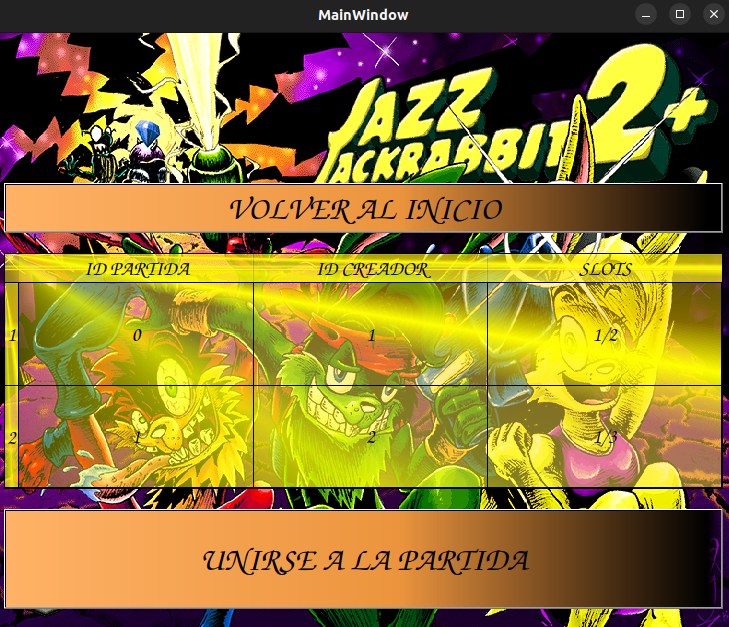

# Manual del Usuario

## Tabla de Contenidos
1. [Requisitos del Sistema](#1-requisitos-del-sistema)
2. [Instalación](#2-instalacion)
3. [Uso del Software](#3-uso-del-software)
   - [Abrir el Servidor](#31-abrir-el-servidor)
   - [Abrir el Cliente](#32-abrir-el-cliente)
   - [Cómo Jugar](#33-cómo-jugar)
   - [Abrir el Editor de Niveles](#34-abrir-el-editor-de-niveles)
   - [Cómo Editar](#35-cómo-editar)
4. [Configuración y Personalización](#4-configuración-y-personalización)
   - [Ajustes del Usuario](#ajustes-del-usuario)
5. [Test](#5-test)


## 1. Requisitos del Sistema
- **Sistema Operativo**
  - Este TP se ha desarrollado y probado en Ubuntu 22.04 LTS. Se recomienda utilizar esta versión o una compatible.
- **Dependencias Necesarias**
  - **Compilador**: `g++` (se recomienda versión 9.3 o superior)
  - **Librerías y Herramientas**:
    - **SDL2pp**: Biblioteca C++ para SDL2.
    - **Qt**: Framework de desarrollo de aplicaciones multiplataforma.
    - **yaml-cpp**: Biblioteca C++ para manejar archivos YAML.
    - **Google Test (gtest)**: Framework de pruebas unitarias para C++.
    - **CMake**: Herramienta de automatización de compilación.
    - **Make**: Herramienta de construcción que controla la generación de ejecutables y otros archivos.


## 2. Instalacion

- **Instalación de Dependencias**
  - **Instalación de SDL**:
    - **Instalación de Dependencias desde apt-get**:
        ```sh
        sudo apt-get install libjpeg-dev libpng-dev libfreetype-dev libopusfile-dev libflac-dev libxmp-dev libfluidsynth-dev libwavpack-dev cmake libmodplug-dev libsdl2-dev
        ```
        Es importante instalar los paquetes `-dev` ya que proporcionan la información necesaria para que CMake vincule estas dependencias.

    - **Instalación de SDL2-image**:
        - Descarga la ultima version de SDL2-image desde [aquí](https://github.com/libsdl-org/SDL_image/releases).
        - Descomprime el archivo, entre a la carpeta y sigue estos pasos:
        ```sh
        mkdir build
        cd build
        cmake ..
        make -j4
        sudo make install
        ```

    - **Instalación de SDL2-mixer**:
        - Descarga la ultima version de SDL2-mixer desde [aquí](https://github.com/libsdl-org/SDL_mixer/releases).
        - Descomprime el archivo, entre a la carpeta y sigue estos pasos:
        ```sh
        mkdir build
        cd build
        cmake ..
        make -j4
        sudo make install
        ```

    - **Instalación de SDL2-ttf**:
        - Descarga la ultima version de SDL2-ttfdesde [aquí](https://github.com/libsdl-org/SDL_ttf/releases).
        - Descomprime el archivo, entre a la carpeta y sigue estos pasos:
        ```sh
        mkdir build
        cd build
        cmake ..
        make -j4
        sudo make install
        ```

    - **Instalación de SDL2pp**:
        - Descarga la ultima version de SDL2pp desde [aquí](https://github.com/libSDL2pp/libSDL2pp/releases).
        - Descomprime el archivo, entre a la carpeta y sigue estos pasos:
        ```sh
        mkdir build
        cd build
        cmake ..
        make -j4
        sudo make install
        ```
  - **Instalación de Qt**:
    ```sh
    sudo apt update
    sudo apt install qt5-default
    ```
  - **Instalación de yaml-cpp**:
    ```sh
    sudo apt-get install libyaml-cpp-dev
    ```
  - **Instalación de Google Test (gtest)**:
    ```sh
    sudo apt-get install libgtest-dev
    ```
  - **Instalación de CMake**:
    ```sh
    sudo apt-get install cmake
    ```
  - **Instalación de Make**:
    ```sh
    sudo apt-get install make
    ```

## 3. Uso del Software
Primeramente, se necesita descargar/clonar el siguiente [repositorio](https://github.com/tomdv18/TpFinalTaller) en una carpeta.

Una vez dentro de la carpeta, debe ejecutar:

  ```sh
  mkdir build
  cd build
  cmake ..
  make
  ```

Nos ubicamos dentro de la carpeta build para poder iniciar el servidor, cliente y editor de niveles.

### 3.1 Abrir el Servidor
Para iniciar el servidor del juego, debe ejecutar:

  ```sh
  ./jazzservidor <puerto>
  ```
El servidor debería iniciarse y estar listo para aceptar conexiones de los clientes.
Si lo desea cerrar, solo tiene que presionar la letra `q`, y se cerrara automaticamente cuando
ya no haya mas clientes en el servidor.

### 3.2 Abrir el Cliente
Para iniciar el cliente del juego, debe ejecutar:

  ```sh
  ./jazzcliente <localhost> <puerto>
  ```
El cliente se iniciará y te permitirá conectarte al servidor ingresando la dirección IP y el puerto del servidor.

### 3.3 Cómo Jugar
Una vez que hayas ejecutado tanto el servidor como el cliente, sigue estos pasos para jugar:

1. **Seleccionar Personaje**:
    - Elige entre los personajes disponibles (Jazz, Spaz, Lori).
    
    - 

2. **Crear/Unirse partida**:
    - Seleccion si desea crear/unirse a una partida.
      - Si crea una partida, debe poner la cantidad de jugadores que puede haber, el mapa y empezarla.
      
      - 

      - Si se une a una partida, debe seleccionar que partida unirse. 
      
      - 

    - En ambas opciones, siempre puede volver hacia atras si se quiere cambiar la opcion seleccionada.

3. **Interfaz**
    - Una vez dentro de la partida, se encontrara con lo siguiente:
    
    - 

    - En la parte superior, vera la cantidad de puntos que acumula el jugador (lado izquierdo), el top 3 de puntajes de los jugadores totales que haya en la partida hasta el momento (lado derecho) y el tiempo (en el medio) en segundos.

    - En la parte inferior, vera la vida que tiene el jugador (lado izquierdo) y el arma que posee actualmente (lado derecho).

4. **Control del Personaje**:
    - `w`: Saltas
    - `a`: Te mueves a la izquierda
    - `d`: Te mueves a la derecha
    - `l`: Disparas
    - `k`: Habilidad especial
    - `r`: Cambiar arma
    - `q`: Salir de la partida
    - `shift + a/d`: Corres

    - 

5. **Dañar enemigo/personaje**:
    - A los enemigos/personaje se les puede dañar usando un arma y/ó habilidad.

    - 


    - 


6. **Obtener puntos**
    - Se puede obtener puntos a traves de la obtencion de gemas/monedas o dañando personajes/enemigos.

    - 


7. **Cambiar arma**
    - Se puede obtener armas a traves del mapa, o matando enemigos.

    - 


8. **Objetivo del Juego**:
    - El objetivo del juego es sumar la mayor cantidad de puntaje posible. Esto se logra dañando enemigos, jugadores (utilizando diversas armas y habilidades especiales) o agarrando gemas/monedas.


9. **Finalizacion del Juego**:
    - El juego finaliza una vez transcurrido cierto tiempo. Al terminar, se mostrara por pantalla la tabla de puntajes y un mensaje verificando de que si
    has ganado o no.

    - 

    - 

### 3.4 Abrir el Editor de Niveles
Para iniciar el editor de niveles, debe ejecutar:

  ```sh
  ./jazzeditor
  ```
El editor de niveles se iniciara y te permitirá crear niveles o editar ya existentes.

### 3.5 Cómo Editar
Una vez que hayas ejecutado el editor de niveles, sigue estos pasos para editar:

1. **Menu de editor**
    - Una vez dentro del editor, vera algo como lo siguiente:
    
    - 

    - Tendra las opciones como:
      - **Cargar mapa**: Te permite cargar mapas ya existentes.
      - **Guardar mapa**: Te permite guardar el mapa actual.
      - **Limpiar mapa**: Te permite limpiar todo el mapa actual.
    
    - Si desea crear un nuevo nivel, simplemente haz click izquierdo en **Volver Atrás** para empezar.

2. **Crear Nivel**
    - Para empezar a crear un nivel, tiene varios elementos del escenario por empezar a colocar.
    
    - 

    - Estos elementos pueden ser:
      - **background**: Fondos del mapa.
      - **beach**: Estructuras del mapa beach.
      - **castle**: Estructuras del mapa castle.
      - **enemigos**: Spawnpoints de distintos tipos de enemigos.
      - **items**: Spawnpoints de distintos tipos de items.
      - **spawn**: Spawnpoints de jugadores.

3. **Controles**
    - `click izquierdo`: Seleccionas la opcion deseada.
    - `click derecho`: Deshaces el elemento del escenario colocado.

4. **Localizacion del nivel**
    - Una vez terminado de editar/crear un nivel, es importante que lo guarde en la carpeta *mapas*, que se encuentra en la carpeta *src*, dentro de la carpeta del repositorio. 

## 4. Configuración y Personalización
- **Ajustes del Usuario**
  - El juego utiliza archivos de configuración para ajustar varios parámetros. Estos archivos están ubicados en el directorio principal del juego.
  - **Archivo de Configuración**: `configuracion.yaml`
    - Ejemplo de contenido del archivo `configuracion.yaml`:
    ```yaml
    personaje:
      vida: 10
      velocidad_x: 5
      velocidad_y: 30 
      gravedad: 3
      tiempo_invulnerabilidad: 3.0
      tiempo_intoxicacion: 5.0
      ancho: 50
      alto: 50
      puntos: 100

    jazz:
      danio_habilidad: 5
      enfriamiento_habilidad: 5.0
      velocidad_y_habilidad: 45 

    spaz:
      danio_habilidad: 5
      enfriamiento_habilidad: 5.0
      velocidad_x_habilidad: 15

    lori:
      danio_habilidad: 5
      enfriamiento_habilidad: 5.0
      velocidad_x_habilidad: 10
      velocidad_y_habilidad: 30

    tiempo_partida: 120

    pantalla:
      lim_x: 2000
      lim_y: 2000
    ...

    ```
  - Para modificar la configuración, abre el archivo `configuracion.yaml` con un editor de texto y ajusta los parámetros según tus necesidades.

## 5. Test
Para testear, simplemente hay que:

- **Primero correr el comando de CMake**

  ```bash
  cmake -DTESTING=ON ..
  ```

- **Luego correr el script de pruebas**

  ```bash
  cd build
  ../tests/run.sh
  ```
